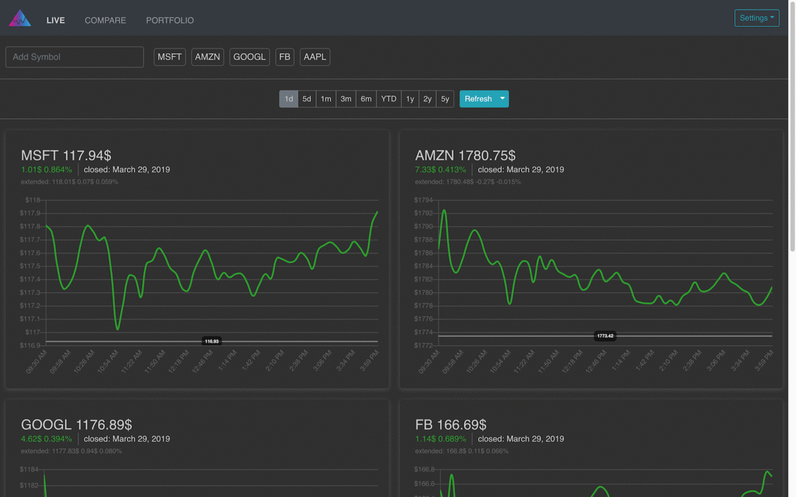

# Stockd

Using this app you can:

- Create multiple portfolios to track profits or watch stocks
- Compare the performance of different stocks

Currently only US stocks are supported

## Install

To quickly spin up Stockd on your localhost, make sure you have Docker installed and then run:

```
docker-compose up -d
```

The following containers will spin up:

- Web App - built using [React](https://reactjs.org/) + [Redux](https://redux.js.org/)
- API - built using [Slim PHP](http://www.slimframework.com/)
- MariaDB - Database to store user data

Once done, you can check it out at: http://localhost:8080
Login credentials: sherlock@holmes.com / doctorwatson

Stocks data is powered by [IEX Cloud](https://iexcloud.io/) API.

## TODO

- User sign up
